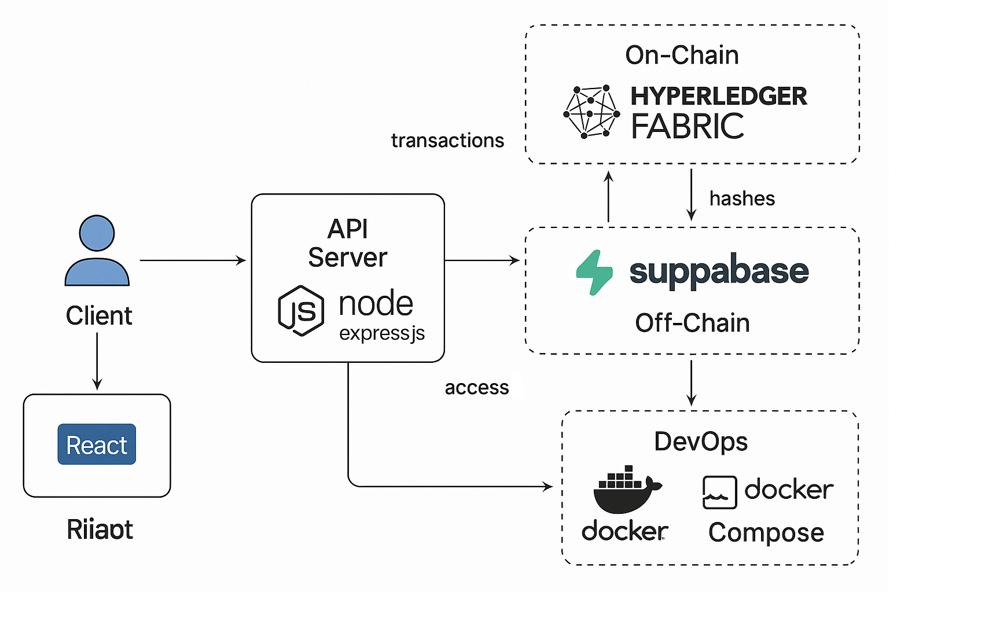

# 깐부대출 - 블록체인 기반 P2P 금융 플랫폼

[](https://opensource.org/licenses/MIT)
[](https://developer.mozilla.org/en-US/docs/Web/JavaScript)
[](https://reactjs.org/)
[](https://tailwindcss.com/)
[](https://nodejs.org/)
[](https://expressjs.com/)
[](https://www.hyperledger.org/use/fabric)
[](https://supabase.io/)
[](https://www.docker.com/)

> 기존 금융권의 높은 문턱과 복잡한 절차를 블록체인 기술로 해결하여, 누구나 신뢰를 기반으로 공정하고 투명하게 금융 거래를 할 수 있는 새로운 대안 금융 생태계를 제공합니다.

<br>

## 목차

- [프로젝트 개요](#프로젝트-개요)
- [주요 기능](#주요-기능)
- [기술 스택](#기술-스택)
- [시스템 아키텍처](#시스템-아키텍처)
- [설치 및 실행](#설치-및-실행)
- [API 문서](#api-문서)
- [팀원 소개](#팀원-소개)
- [라이선스](#라이선스)

<br>

## 프로젝트 개요

**깐부대출**은 Hyperledger Fabric 블록체인 네트워크를 기반으로 한 개인 간(P2P) 대출 중개 플랫폼입니다. 스마트 컨트랙트를 통해 대출 계약의 전 과정을 자동화하고, 계약의 모든 내용을 블록체인 원장에 기록하여 투명성과 신뢰성을 확보합니다. 이를 통해 사용자는 비싼 법률 비용이나 복잡한 심사 절차 없이, 개인의 신용을 바탕으로 안전하게 자금을 빌리고 빌려줄 수 있습니다.

<br>

## 주요 기능

- **📄 스마트 컨트랙트 기반 계약:** 모든 대출 계약은 체인코드로 구현되어 조건 충족 시 자동으로 실행되며, 계약 내용은 위변조가 불가능한 블록체인 원장에 영구히 기록됩니다.
- **💯 자체 신용 평가 시스템:** 대출 상환 이력, 기간 준수 여부 등을 종합하여 사용자의 신용 점수를 동적으로 평가하고, 이를 대출 심사에 활용합니다.
- **🤝 P2P 대출 신청 및 중개:** 사용자는 원하는 조건으로 대출을 신청하고, 다른 사용자는 게시된 요청을 보고 대출을 제안할 수 있습니다.
- **✍️ 계약서 이미지화 및 무결성 검증:** 체결된 계약서는 이미지 파일로 생성되며, 이 파일의 해시(Hash)값이 블록체인에 저장되어 원본임을 증명하고 위변조를 방지합니다.
- **📊 투명한 거래 내역:** 모든 대출 실행 및 상환 내역은 블록체인에 기록되어 누구나 거래 과정을 투명하게 확인할 수 있습니다.

<br>

## 기술 스택

| 구분 | 기술 | 목적 |
| :--- | :--- | :--- |
| **Blockchain** | **Hyperledger Fabric** | Private, Permissioned 블록체인 네트워크 구축 |
| | **JavaScript** | 체인코드(스마트 컨트랙트) 개발 |
| **Backend** | **Node.js, Express.js** | RESTful API 서버 구축 및 비즈니스 로직 처리 |
| **Frontend** | **React** | 사용자 인터페이스(UI) 및 사용자 경험(UX) 구현 |
| | **Tailwind CSS** | 반응형 및 모던 스타일링 |
| **Database** | **Supabase (PostgreSQL)** | 사용자 프로필, 계약서 원본 등 Off-Chain 데이터 저장 |
| **DevOps** | **Docker, Docker Compose** | 개발 환경 및 네트워크 구성 자동화 |

<br>

## 시스템-아키텍처

본 프로젝트는 **하이브리드 아키텍처**를 채택하여 블록체인의 신뢰성과 기존 시스템의 효율성을 모두 확보했습니다.

1.  **사용자 (Client):** React로 구현된 웹 애플리케이션을 통해 서비스와 상호작용합니다.
2.  **API 서버 (Backend):** 사용자의 요청을 받아 비즈니스 로직을 처리합니다. 데이터의 성격에 따라 블록체인 또는 데이터베이스와 통신합니다.
3.  **데이터베이스 (Off-Chain):** Supabase를 사용하여 사용자 프로필, 알림, 자주 변경되는 데이터, 그리고 **계약서 이미지 원본 파일**과 같이 용량이 큰 데이터를 저장합니다.
4.  **블록체인 (On-Chain):** Hyperledger Fabric 네트워크에는 대출 계약의 체결, 상태 변경(상환 등)과 같은 핵심 트랜잭션과 **계약서 파일의 해시(Hash) 값** 등 위변조되어서는 안 될 데이터만 기록하여 무결성을 보장합니다.

  

<br>

## 설치-및-실행

### 사전 요구사항

- Docker & Docker Compose
- Node.js (v16 이상)

### 설치 과정

```bash
# 1. 프로젝트 클론
git clone https://github.com/your-username/kkangbu.git
cd kkangbu

# 2. Fabric 네트워크 실행 (Docker)
cd basic-network
./network.sh up

# 3. 서버 애플리케이션 실행
cd ../application
npm install
npm start

# 4. 클라이언트 애플리케이션 실행
cd client/loan-client
npm install
npm start
```

<br>

## API-문서

본 프로젝트는 백엔드와 프론트엔드의 API 명세를 각각 관리합니다.

### 1. 백엔드 API 명세서

서버의 전체 엔드포인트에 대한 명세입니다. 아래 링크에서 확인하실 수 있습니다.

- **[백엔드 API 명세서 바로가기](https://blue-b.github.io/kkangbu/backend-api.html)**

### 2. 프론트엔드 API 명세서 (JSDoc)

프론트엔드 `services/api.js` 모듈의 함수 명세입니다. 소스 코드의 JSDoc 주석을 기반으로 자동 생성된 웹 문서입니다.

- **[프론트엔드 API 웹 문서 바로가기](https://blue-b.github.io/kkangbu/global.html)**

> **참고:** 위 링크가 작동하려면 아래의 GitHub Pages 설정이 필요합니다. 만약 로컬에서 문서를 생성하고 확인하려면, 프로젝트 루트에서 `npm run docs` 명령 실행 후 `docs/frontend/index.html` 파일을 브라우저로 열어주세요.


<br>

## 팀원-소개


| 역할 | GitHub |
| :--- | :--- |
| 리더, 풀스택 개발 | [kjaewon4](https://github.com/kjaewon4) |
| 풀스택 개발 | [Blue-B](https://github.com/Blue-B) |
| 풀스택 개발 | [fjdjsfh](https://github.com/fjdjsfh) |
| 프론트엔드 개발 | [pakrksiqkslx](https://github.com/pakrksiqkslx) |
| 프론트엔드 개발 | [yunseok36](https://github.com/yunseok36) |


<br>

## 라이선스

이 프로젝트는 [MIT 라이선스](https://opensource.org/licenses/MIT)를 따릅니다. 자세한 내용은 `LICENSE` 파일을 참고하세요.
